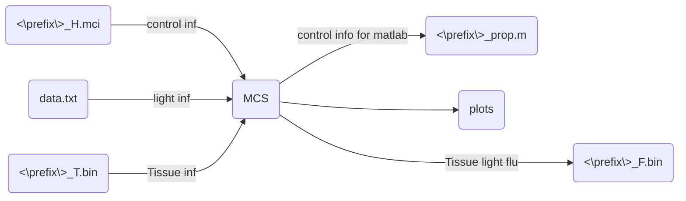

# MonteCarloSimulation

This repository build a simple discrete photon statistical model based with transport theory, By using Monte Carlo simulation method with python.

Similar with other Monte Carlo Method explained  in Biomedical Photonics , our method basically consistent with the model assumptions of the textbook

Since this repository currently in beta, only build a proto example and you can get more info in our [params-card](./docs/params.md)

For the reason that python is an interpreted language, and running speed is too slow compared to compiled language. If we have time left in the following works, we will consider providing a gpu version of the program.

## Install

This project build with origin python, you only need to install numpy、scipy、matplotlib now, or you can create a conda env and run following code:

```
conda create -n MCS python=3.8
conda activate MCS
pip install -r requirements.txt
```

## Simulation

After clone and config environment you need to run following script to generate `[perfix]_T.bin` in the directory of `./bin_input/`.

```
python build_0_tissue_bin.py
```

Then you can directly run following code to begin simulation.

```
python [file].py --photon_number [your photon number]
```

You can get more [file] info in the following notes.

Don't forget prepare `<\prefix\>_H.mci` and `data.txt` at input file path.



enjoy

### Daily update

### 2023/02/21

更新了添加探头前后的对比效果，谁那么认真写readme？后面开始放飞自我

### 2023/02/21

追加了三个检查点的对比效果

| 检查点   | checkpoint_name    |
| -------- | ------------------ |
| 镜头玻璃 | check_1_from_glass |
| 探头玻璃 | check_2_to_glass   |
| 探头本身 | check_3_in_probe   |

目前可以运行以下个可执行文件

- `l_0_simulation_proto.py`比较纯净的蒙特卡洛模拟，不过相应的，仅收集的光通量矩阵
- `l_1_sim_with_route.py` 执行未经检查点的模拟，添加了针对光子移动轨迹的数组，没有特别影响效率
- `l_2_sim_with_check.py` 加入检测光子是否入射到探头位置的检测（三个检测点全满足，百分比很低，基本上1000个光子智能满足两三个），因为加入了一些矩阵计算，比较耗时
- `l_3_check_with_3_step.py` 执行按照上表所示的多个检测，在模拟后在原有的基础上
    - 过 检查点1 的光通量矩阵
    - 过 检查点1、检查点2 的光通量矩阵
    - 过 检查点1、检查点2、检查点3 的光通量矩阵

每个光子移动路径、光子权重、检查点信息储存到 `[prefix]_infos_list.mat` 文件中,下面展示了文件储存格式

- check_list  [10000,3]
    - [3,]  equal with [check_1_from_glass, check_2_to_glass, check_3_in_probe]
- pho  [1,10000]  建议调整成  pho[0] 为 [10000,]
    - [route_length, 3]
        - [3, ]  [x,y,z]
- idx  [1,10000]  建议调整成  idx[0] 为 [10000,]
    - [route_length, 3]
        - [3, ]  [x,y,z]
- weight  [1,10000]  建议调整成  weight[0] 为 [10000,]
    - [1, route_length]
        - [1,]  [weight] 

非注释会执行整个流程，若注释`simulation(option, photon, probe, light, tissue)` 仅执行最后光子路径的绘图工作，需要依赖 [prefix]_infos_list.mat ， 比较耗时，真的，而且不建议很高光子数量的前提下，绘制过多的光子路径，这样会相当耗时

对于后续的绘图函数，变量`choose`设置0~7对应以下几种检查点的情况，可根据需要注释一些，**因为真的很慢**

| **checks** | **1_from_glass** | **2_to_glass** | **3_in_probe** | choose |
| :--------: | :--------------: | :------------: | :------------: | :----: |
|     1      |      False       |     False      |     False      |   0    |
|            |      False       |     False      |      True      |   1    |
|            |      False       |      True      |     False      |   2    |
|            |      False       |      True      |      True      |   3    |
|     2      |       True       |     False      |     False      |   4    |
|            |       True       |     False      |      True      |   5    |
|     3      |       True       |      True      |     False      |   6    |
|     4      |       True       |      True      |      True      |   7    |

这里建议如果想跑`l_3_check_with_3_step.py`的话，

先把`simulation(option, photon, probe, light, tissue`) 后面都注释了跑一遍，

再解除后面的注释，并注释掉 `simulation(option, photon, probe, light, tissue)` 再跑一边(中间变量储存在`[prefix]_infos_list.mat`中，不会出大问题 ) 